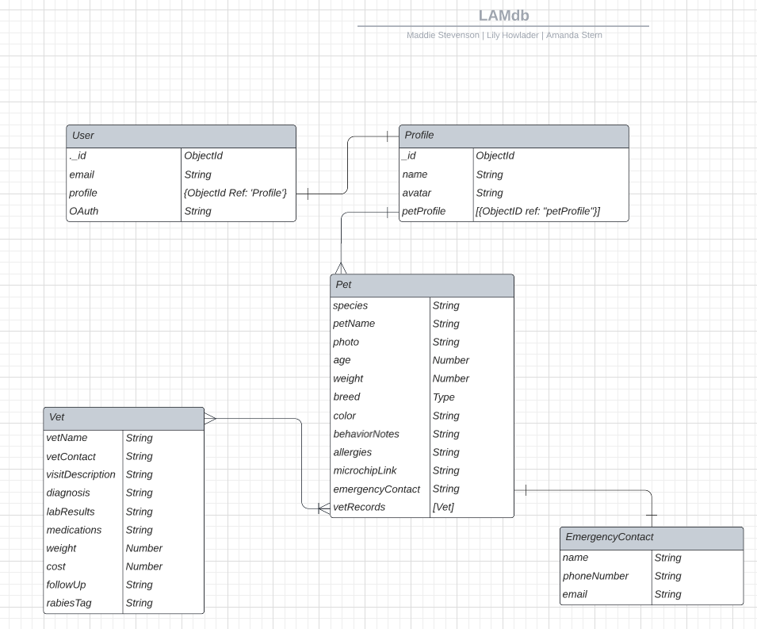

# LAMdb

## Welcome to our LAMDdb app!
It’s hard to keep track of vet records and invoices over the years, and most of us as pet owners rely solely on our email to do so. No matter if you have one fur-baby or five, that lack of organization makes managing our pet health history a challenging and daunting task! 

This app will: 
- Be the single point of organization that keeps track of your pet’s records for their wellbeing.
- Store important information about your pets’ in their pet profile (this includes allergies, microchip number, behavior notes etc).
- Store individual vet records for each vet visit your pet has.

We hope you enjoy this app! 

# Contributors:
- Amanda Stern
- Lily Howlader
- Maddie Stevenson
  
# Link to [LAMdb](https://lamdb.netlify.app/)

# Planning Materials:
### Link to [Trello Board](https://trello.com/b/Of4o4JVy/lamdb)

### Link to our [Whimsical](https://whimsical.com/lamdb-K2TjcLPjY9Ve3bbPKog8FU)

### ERD:

### Desktop View:
### Mobile View:

## Technologies Used:
- React JS
- MongoDB
- JWS Auth
- VS Code
- CSS
- Whimsical
- Git
- Trello
  
## Credits: 
- Paw Print favicon used from Isabella Baillie on Giphy - https://giphy.com/stickers/paw-pawprint-print-fXWP44L91ioNZQSh2G
- Sheep image from pixy.org - https://pixy.org/4523919/

## Next Steps:
- Implement community feature.
- Add components for pet's preferred toys and foods.
- Allow PDF uploads from vet visits.
- All update feature for vet records.